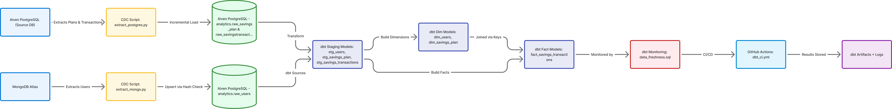

# Nomba Data Engineering Assessment

**Author:** Muhammad Yekini
📧 [myekini1@gmail.com](mailto:myekini1@gmail.com)

End-to-end cloud data pipeline that captures incremental changes from **MongoDB Atlas** and **Aiven PostgreSQL**, transforms them with **dbt**, and validates pipeline health through **GitHub Actions CI/CD**.

---

## Architecture Overview

<p align="center">
  
</p>

_Click the image above to open the live interactive diagram on [Figma](https://www.figma.com/board/BlEnGCPJrOx3cMeaDTWGG4/Nomba-CDC-and-dbt-Cloud-Architecture?node-id=0-1&t=Eu8ILmXDAMyoesON-1)._

---

## Quick Start

### 1. Clone the Repository

```bash
git clone https://github.com/<your-username>/nomba-pipeline.git
cd nomba-pipeline
```

### 2. Set Up Environment Variables

Create a `.env` file in the project root:

```bash
MONGO_URI=<your-mongodb-atlas-uri>
PG_HOST=<aiven-host>
PG_PORT=11234
PG_USER=avnadmin
PG_PASSWORD=<your-password>
PG_DB=defaultdb
PG_SSLMODE=require
```

### 3. Generate Sample Data

```bash
python data/generate_sample_data.py
```

### 4. Run CDC Jobs

```bash
python cdc/extract_mongo.py
python cdc/extract_postgres.py
```

### 5. Run dbt Transformations

```bash
dbt deps
dbt build
```

### 6. Check Data Freshness

```bash
dbt run --select monitoring.data_freshness
```

---

## Project Structure

| Directory / File                | Description                                      |
| ------------------------------- | ------------------------------------------------ |
| `cdc/extract_mongo.py`          | Syncs user data from MongoDB Atlas → Postgres    |
| `cdc/extract_postgres.py`       | Captures incremental changes from Aiven Postgres |
| `data/generate_sample_data.py`  | Seeds realistic Nigerian market test data        |
| `models/staging/`               | dbt staging models (raw → clean)                 |
| `models/marts/`                 | dbt marts and analytics models                   |
| `models/monitoring/`            | Data freshness and health checks                 |
| `.github/workflows/dbt_ci.yml`  | CI pipeline for automated dbt testing            |
| `docker-compose.yml` (optional) | Local warehouse setup for testing                |

---

## Testing Instructions

1. Generate base data:

   ```bash
   python data/generate_sample_data.py
   ```

2. Simulate new updates:

   ```bash
   python data/generate_sample_data.py --incremental
   ```

3. Run transformations:

   ```bash
   dbt build
   ```

4. Verify freshness:

   ```bash
   SELECT * FROM monitoring.data_freshness;
   ```

5. Review CI/CD in GitHub → Actions tab (dbt build + test runs).

---

## Design Decisions

| Area         | Choice                                               | Rationale                                  |
| ------------ | ---------------------------------------------------- | ------------------------------------------ |
| CDC Strategy | Hash-based for MongoDB, timestamp-based for Postgres | Balances idempotency and simplicity        |
| Deployment   | Fully cloud (MongoDB Atlas + Aiven Postgres)         | Removes local dependency and scales easily |
| dbt Layout   | `staging → marts → monitoring`                       | Ensures modular, reusable transformations  |
| Monitoring   | Freshness model in dbt                               | Lightweight observability                  |
| CI/CD        | GitHub Actions                                       | Automated data validation per PR           |

---

## Future Enhancements

- Add **SCD Type 2** to dimension tables
- Integrate **Airflow or Dagster** for orchestration
- Build **data quality dashboards** (Great Expectations / Metabase)
- Add **Slack alerting** for data staleness
- Expand CDC to include **event-driven triggers**

---

## Contact

**Muhammad Yekini**
📧 [myekini1@gmail.com](mailto:myekini1@gmail.com)
🌐 [LinkedIn](https://linkedin.com/in/myekini)

---
